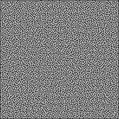
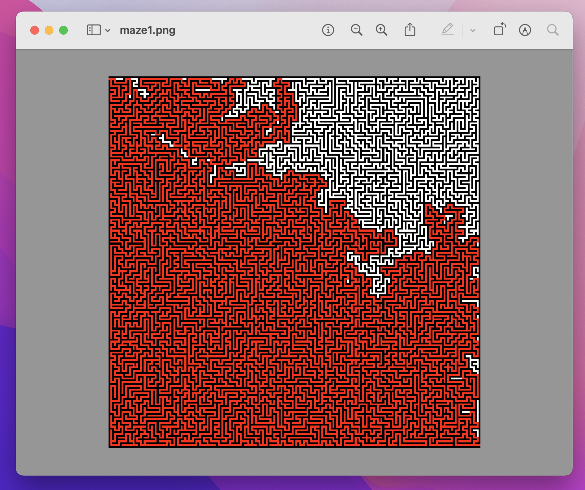

# maze-solver

A maze solver written in C.

## Constraints
- Only PNG files
- Mazes must be square
- Walls must be black `rgb(0, 0, 0)` and path white `rgb(255, 255, 255)`
- Walls and path must be 1 px width
- The starting point must be at `(x: 0, y: 1)`
- The ending point must be at `(x: width, y: height - 1)`

## Usage

1. Build executable
2. Make a folder names `mazes` and place your mazes there.
3. Make a folder named `sols`. The script place the solutions here.

## Resources
- [Maze generator](https://keesiemeijer.github.io/maze-generator/#generate)
- [Libpng example](http://zarb.org/~gc/html/libpng.html)
- [Libpng manual](http://www.libpng.org/pub/png/libpng-1.2.5-manual.html)
- [Inspired by Dr Mike Pound (Computerphile video)](https://www.youtube.com/watch?v=rop0W4QDOUI)