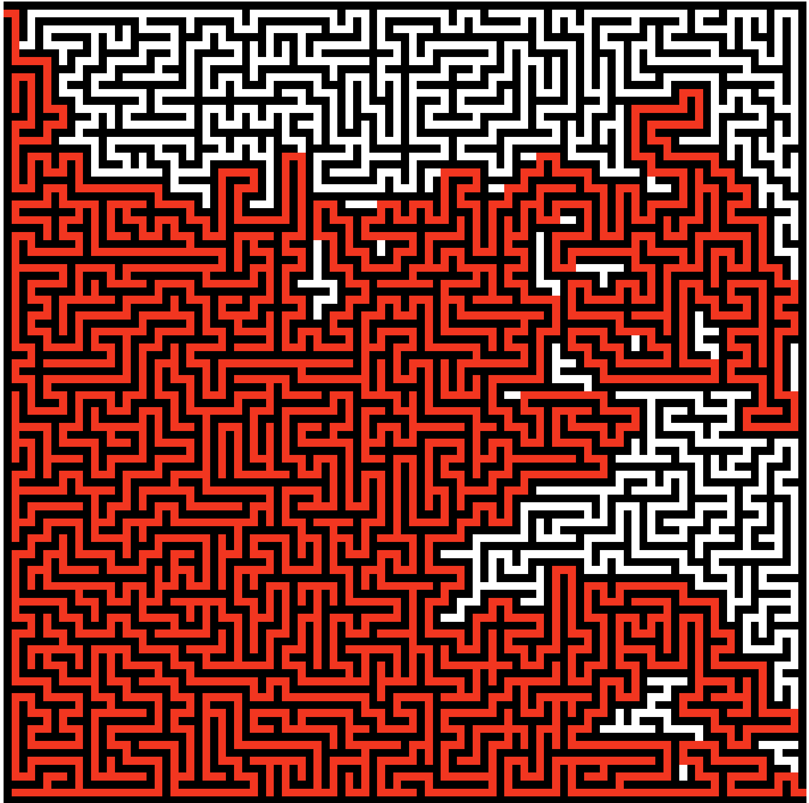

# maze-solver

I recently saw the [Maze solving youtube video](https://www.youtube.com/watch?v=rop0W4QDOUI) from Computerphile and I find it very interesting. So I decided to build my own maze solver program.

It’s a C program that takes a maze PNG and outputs the solution using the [Wall Follower algorithm](https://en.wikipedia.org/wiki/Maze-solving_algorithm)

## Constraints

-   Only PNG files
-   Mazes should be square
-   Walls should be black `rgb(0, 0, 0)` and path white `rg(255, 255, 255)`
-   Walls and path should be `1px` width
-   The starting point must be at `(x: 0, y: 1)`
-   The ending point should be at `(x: width, y: height - 1)`

## Usage

-   Build executable
-   Make a folder named `mazes` and place your mazes there
-   Make a folder named `sols`. The script place the solutions here
-   Run the program `./maze_solver maze1.png`

### Input


```bash
$ ./maze_solver maze.png
Filename: maze.png
Width: 101
Height: 101
Algorithm duration: 0.000121 seconds
```

### Output



## Note

You can use this [website](https://keesiemeijer.github.io/maze-generator/) to generate mazes
